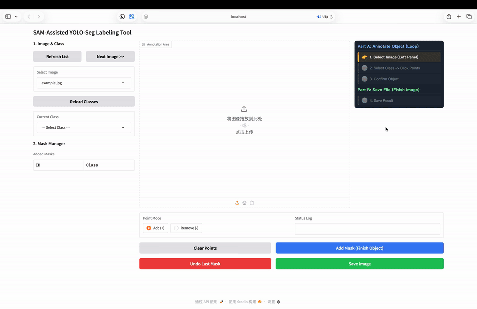

# SAYOLO-Seg: SAM-Assisted YOLO Segmentation Labeling Tool

[中文文档](README_zh.md) | [English](README.md)

SAYOLO-Seg is an efficient, semi-automated annotation tool designed for **Instance Segmentation** tasks. It leverages the power of **Segment Anything Model (SAM)** to generate high-quality polygon masks from simple point prompts, significantly accelerating the dataset creation process for YOLOv8/v11 segmentation models.

## ✨ Features

*   **⚡ SAM-Powered Annotation**: Click to generate masks instantly. No need for tedious manual polygon drawing.
*   **🎯 YOLO-Seg Compatible**: Automatically exports annotations in standard YOLO segmentation format (`class x1 y1 ...` normalized).
*   **🧩 Smart Fragment Handling**: Intelligent algorithms to handle object occlusions (e.g., a bowl splitting a table into two parts) while filtering out noise.
*   **🛠️ Complete Pipeline**: Includes scripts for **Data Augmentation** (simulating robot views), **Dataset Splitting**, **Training**, and **Inference**.
*   **🔒 Privacy Focused**: The UI hides absolute server paths, making it safe for demos and sharing.

## 📺 Demo



*Watch the video to see how to annotate complex objects in seconds.*

## 📂 Project Structure

```text
SAYOLO-Seg/
├── app.py                  # Main Gradio application
├── classes.txt             # Object class definitions
├── requirements.txt        # Dependencies
├── data/                   # Place your raw images here
├── output/                 # Annotated labels and images save here
│   ├── images/
│   └── labels/             # YOLO format .txt files
├── weights/                # Place SAM model weights here (optional)
└── scripts/
    ├── split_dataset.py    # Split data into train/val
    ├── augment_data.py     # Offline augmentation (Albumentations)
    ├── train.py            # Train YOLOv8-Seg model
    └── inference.py        # Run inference on new images
```

## 🚀 Quick Start

### 1. Installation

```bash
git clone https://github.com/UniqueYwY/SAYOLO-Seg.git
cd SAYOLO-Seg
pip install -r requirements.txt
```

### 2. Download Weights

Download the Segment Anything Model (SAM) weights (e.g., `sam_vit_b_01ec64.pth` or MobileSAM) and place them in the `weights/` directory.

> You can configure the model path in `app.py` if needed.

### 3. Configure Classes

Edit `classes.txt` in the root directory. Add your object names, one per line.

```text
person
car
background
```

### 4. Run the Labeling Tool

```bash
python app.py
```

*   Open your browser at `http://localhost:7860`
*   **Step 1**: Select an image from the list.
*   **Step 2**: Select a class.
*   **Step 3**: Click on the object to add points (+). Right-click or check "Remove" to exclude areas (-).
*   **Step 4**: Click **"Add Mask"** to confirm the object.
*   **Step 5**: Click **"Save Image"** when finished.

## 🛠️ Workflow: From Labeling to Training

1.  **Labeling**: Annotate your images. Results are saved in `output/`.
    ```bash
    python app.py
    ```
2.  **Splitting**: Organize `output/` into a standard `train/val` structure in `dataset/`.
    ```bash
    python scripts/split_dataset.py
    ```
3.  **Augmentation (Optional)**: Generate augmented samples (e.g., simulating distant robot views).
    ```bash
    python scripts/augment_data.py
    ```
4.  **Training**: Fine-tune a YOLOv8-Seg model on your dataset.
    ```bash
    python scripts/train.py
    ```

## 📝 License

This project is open-sourced under the MIT License.
